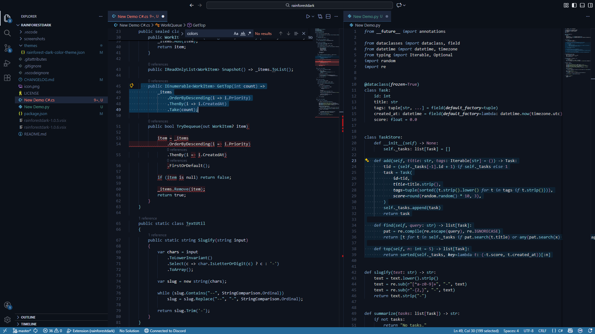

# Rainforest Dark

A dark, lush theme inspired by forest and rain. The goal of this theme was to create an aesthetic looking theme that feels calm, focused, and easy on the eyes.

Created for personal use, colors may be tweaked here and there.

---
## Preview

---

## Color Palette

### Syntax Colors
Used for code tokens.

| Color               | Hex       | Usage                             |
| ------------------- | --------- | --------------------------------- |
| **Frost Blue**      | `#81A1C1` | Keywords, control flow, operators |
| **Soft Lime**       | `#9CC778` | Secondary strings, highlights     |
| **Muted Sage**      | `#A3BE8C` | Strings, literals                 |
| **Fresh Green**     | `#A0D175` | String variants, success hints    |
| **Ice Teal**        | `#8FBCBB` | Types, interfaces                 |
| **Sky Cyan**        | `#86C7D9` | Functions, classes, namespaces    |
| **Lavender Violet** | `#B481AB` | Constants, bools, numbers         |
| **Warm Sand**       | `#EBCB8B` | Annotations, decorators           |

---

### Editor Foreground Colors
Used for foreground elements like text or borders.

| Role               | Hex       |
| ------------------ | --------- |
| **Blue Off-White**   | `#DADFEA` |
| **Pale White** | `#CAD2E0` |
| **Muted Gray**     | `#9AAAC9` |
| **Comment Gray**   | `#707E99` |
| **Deep Muted**     | `#4D576B` |

---

### UI Colors
Used for editor, panels, and layered UI surfaces.

| Name              | Hex       | Description            |
| ----------------- | --------- | ---------------------- |
| **Deep Navy**     | `#1D273B` | Editor background      |
| **Midnight Blue** | `#0F141E` | Panels, sidebars       |
| **Black Ice**     | `#0C1119` | Deep background layers |
| **Shadow Navy**   | `#1F283B` | Secondary surfaces     |
| **Cool Azure**      | `#4385C0` | Active UI highlights |
| **Dark Steel Blue** | `#174A77` | Subtle accents       |
| **Ocean Blue**      | `#1E578A` | Hover states         |
| **Evergreen**       | `#326037` | Secondary accents    |

---

### Highlight & Search Colors
Used for selections, find, and match results.

| Name               | Hex         | Description         |
| ------------------ | ----------- | ------------------- |
| **Selection Navy** | `#0D3754`   | Selection highlight |
| **Neon Mint Glow** | `#00EAA838` | Active match glow   |
| **Spruce Match**    | `#14452a`   | Match background    |
| **Slate Overlay**  | `#27324166` | Range highlight     |

---

### Diagnostics & Git Colors
Used for errors, warnings, info, and source control.

| Name                | Hex       | Description            |
| ------------------- | --------- | ---------------------- |
| **Soft Error Red**  | `#EA5F5F` | Errors                 |
| **Muted Error Red** | `#CC7272` | Secondary errors       |
| **Amber Warning**   | `#D19523` | Warnings               |
| **Info Sky Blue**   | `#86B1E8` | Informational messages |
| **Git Red**         | `#AD1E25` | Deleted files          |
| **Git Green**       | `#7A9B36` | Added files            |
| **Git Cyan**        | `#308AA3` | Modified files         |